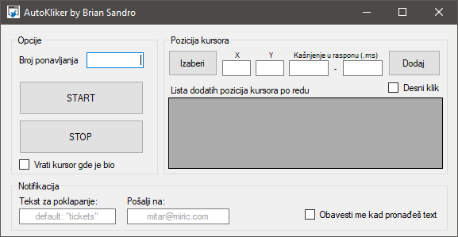

# Advanced mouse clicking tool

## All best features combined in one tool.
- Clicking on multiple locations
- Left or right click
- Custom time range
- Revert cursor to position before click
- Notification when something on screen is found (active window screenshot -> OCR -> alert on your mail/phone)

## Quick start
> Just build project and run **.exe** (if you won't to use notification feature)

> or download **.exe** from Release

> To use notification you need ***Tesseract*** (for OCR). Install Tesseract and put **tessdata** folder to env path (TESSDATA_PREFIX).
>> Link for download: https://digi.bib.uni-mannheim.de/tesseract/tesseract-ocr-w64-setup-v5.2.0.20220712.exe